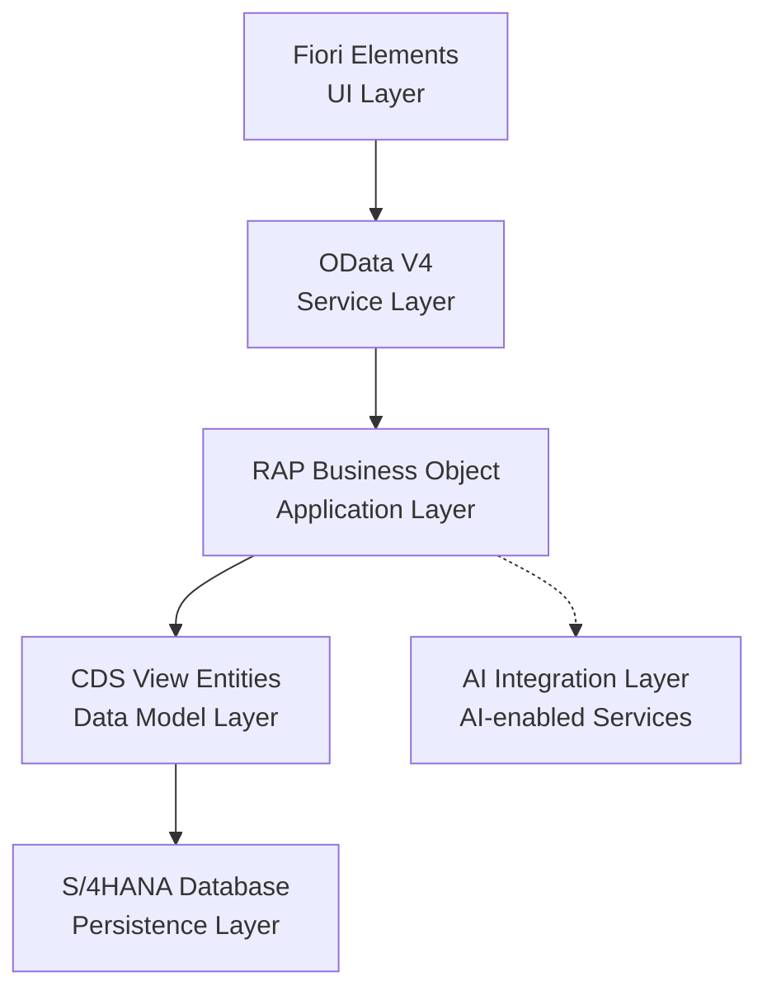

# System Architecture - SAP S/4HANA AI Portfolio

## Overview

This project follows a modern SAP S/4HANA development architecture based on SAP Clean Core principles.

The core application architecture is built using:

* ABAP Cloud
* Core Data Services (CDS)
* RESTful Application Programming Model (RAP)
* OData V4
* Fiori Elements

The architecture is designed to provide a clean, cloud-ready, and extensible foundation for integrating AI capabilities into SAP business processes.

## Architecture Diagram

## Development Principles

### Clean Core

The application follows SAP Clean Core principles to ensure that business logic remains upgrade-safe, maintainable, and extensible.

Key principles include:

* Avoid modifications to SAP standard objects
* Use released SAP APIs and extension points
* Keep custom development isolated from the SAP standard
* Prefer cloud-ready and upgrade-stable development approaches

### RAP Approach

The application follows the SAP RESTful Application Programming Model (RAP) to implement transactional business applications.

The development approach includes:

* Data modeling with CDS view entities
* Business behavior definition and implementation
* Transactional processing through RAP
* Service exposure using OData V4
* Fiori Elements for metadata-driven user interfaces

